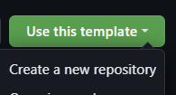

# TeXLive-ja
> Win11 + WSL2 + docker + vscode (Dev Containers + LaTex Workshop)で日本語TeXLive環境構築

# How to Use

1. push "Use this template" button and create a new repository

2. (optional) enable a GitHub workflow for auto build and release PDF (see below)
3. git clone your repository
4. open vscode then use the dev container

See [Documentation (Japanese)](./doc/how-to-use.ja.md) for detail.

# Example of building IPSJ tech-jsample.tex
- http://www.ipsj.or.jp/journal/submit/style.html

# Auto build LaTeX and release PDF
Push git tags starting with "v" to automatically build main.tex and release PDF of the result

- To allow github workflow to do automatic releases, the following settings are required
  - Settings > Actions > General > Workflow permissions 
    - set "Read and write permissions"

# Pre-build Docker image
- is available on Docker Hub 
  - https://hub.docker.com/repository/docker/range3/texlive-ja/general
